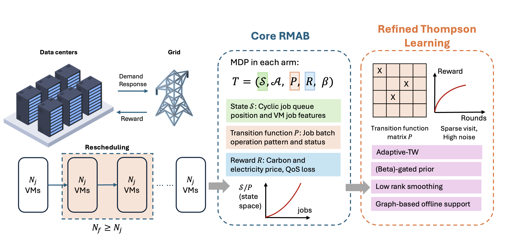
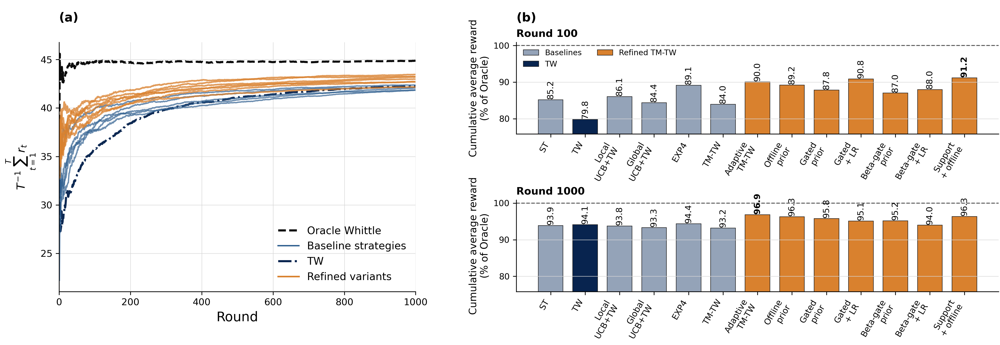
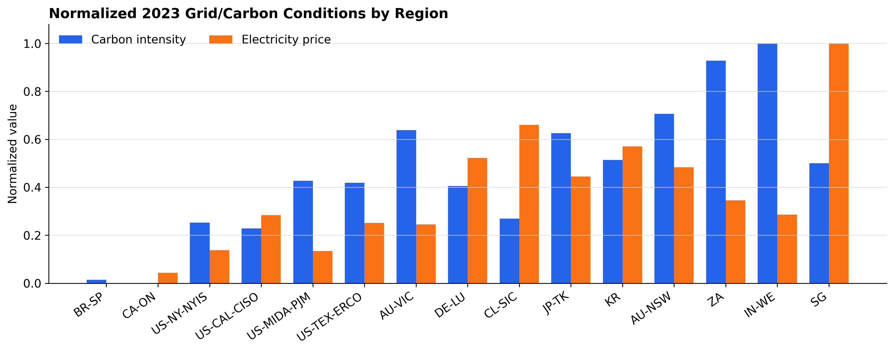

# RACER: Robust and Adaptive Computing and Energy Resource Coordination Framework

<p align="center">
  <a href="LICENSE"></a>
  <a href="https://www.python.org/downloads/"></a>
</p>

This repository contains the datasets and experimental results associated with the submission: *Refined Thompson Learning for Adaptive Restless Bandits: Power-Efficient Flexibility Scheduling Across Data Centers*.




## Contents

### Datasets

| Path | Contents | Use / Notes |
| --- | --- | --- |
| `datasets/datacenter_with_metrics/` | Processed data-center VM/job datasets named `datacenter_*_with_metrics.csv`. | Consumed by the real-data and region-grid load-balancing experiments. |
| `datasets/carbon_intensity/` | Regional hourly carbon-intensity data. | Used to construct grid/carbon-cost features for load-balancing experiments. |
| `datasets/electricity_prices_processed/` | Processed regional electricity-price CSV files. | Provides regional price inputs. |
| `datasets/electricity_prices_standardized/` | Standardized electricity-price CSV files aligned for cross-region use. | Kept because the region-grid experiments use standardized grid-cost inputs. |
| `datasets/power_qos_distribution/` | Power-saving index and QoS-cost distribution figure. | Includes the generated figure and plotting script copied from `current_paper_artifacts/power_qos_distribution/`. |

### Experiment Outputs and Reproduction Scripts

The experiments cover three settings:

- **Baseline:** simple 8-state setting with 5 arms, batch size 5, 1000
  rounds, and 10 random seeds. This setting evaluates performance when the
  state space is small and online learning has many rounds.
- **Transition stress:** larger sparse-transition setting with 5 arms, 8--100
  states, batch size 5, 100--200 rounds, and 3 random seeds. This setting
  stresses transition learning when online observations are limited.
- **Load-balance product-state:** high-dimensional data-center load-balancing
  setting with 8 arms, 20--180 states, 250 rounds, and 2 random seeds. This
  setting adds grid, carbon, geographic, and heterogeneous processing-capacity
  features across data centers.

Across these settings, we use multiple random seeds and hyperparameter sweeps
for refinement parameters such as the trust floor and beta gate.

- **Baseline:** `baseline_setting_suite_v1`
  - Output: `experiments/baseline_setting_suite_v1/`
  - Scripts: `reproduction_scripts/baseline_setting_suite_v1/`
  - Summary: baseline synthetic suite with reward summaries, learning curves,
    round-bar comparisons, and seed-level checkpoint diagnostics.



**Highlight:** The refined Thompson learning variants generally outperform the
baseline, and the final reward exceeds the state-of-the-art EXP4 framework.

- **Transition stress:** `context_noise_real_data_v1`
  - Output: `experiments/context_noise_real_data_v1/`
  - Scripts: `reproduction_scripts/context_noise_real_data_v1/`
  - Summary: transition-stress context-noise outputs, including summary CSVs,
    figures, LaTeX tables, best-beta-gate analysis, and refined win-frequency
    plots.

- **Load-balance product-state:** `load_balance_region_grid_event_driven_tw_final_v1`
  - Output: `experiments/load_balance_region_grid_event_driven_tw_final_v1/`
  - Scripts: `reproduction_scripts/load_balance_region_grid_event_driven_tw_final_v1/`
  - Input: `supporting_inputs/grid_cost_features_v1/`, generated by
    `reproduction_scripts/grid_cost_features_v1/`
  - State notation: in the product state `(q, g, o)`, `q` is the queue or
    backlog bucket, `g` is the grid/carbon condition from
    `grid_cost_region_averages_2023_normalized.csv`, and `o` is the operation
    type: interactive-heavy, batch/flexible, or geo-migratable.

> [!NOTE]
> Considering the increasing product state and Whittle index computation time,
> we use the event-based Whittle index method.
>
> Python scripts: `experiments/run_region_grid_event_driven_tw.py`,
> `experiments/run_region_grid_load_balance_sweep.py`,
> `root_helpers/Event_driven_TW_varying_data_center_jobs.py`.
>
> CSV results: `homo_norm__event_driven_tw_region_grid_results.csv`,
> `homo_norm__event_driven_tw_region_grid_summary.csv`,
> `heter_norm__event_driven_tw_region_grid_results.csv`,
> `heter_norm__event_driven_tw_region_grid_summary.csv`.

Generated summary artifacts can be rebuilt from the retained source outputs:

```bash
python reproduction_scripts/grid_cost_features_v1/scripts/plot_normalized_carbon_electricity_bars.py
python experiments/baseline_setting_suite_v1/generate_baseline_setting_checkpoint_diagnostics.py
python experiments/load_balance_region_grid_event_driven_tw_final_v1/generate_timing_tw_full_vs_event.py
```

### Supporting Inputs

- `supporting_inputs/grid_cost_features_v1/`
  - Region-level grid-cost features used by the region-grid experiments.
  - Main files:
    - `grid_cost_region_averages_2023.csv`
    - `grid_cost_region_averages_2023_normalized.csv`



## Notes

- Python 3.9 or later is recommended for running the reproduction scripts.
- Required Python packages: `numpy`, `pandas`, `matplotlib`, and `seaborn`.
- Install the package dependencies with:

```bash
pip install numpy pandas matplotlib seaborn
```

- The scripts use `matplotlib` for figure generation and can run in headless
  environments using the non-interactive `Agg` backend configured in the
  plotting scripts.

## License

This repository is licensed under the MIT License. See [LICENSE](LICENSE) for
details.
